# MATLAB Integration for Jupyter
----
[](https://github.com/mathworks/jupyter-matlab-proxy/actions) [](https://pypi.python.org/pypi/jupyter-matlab-proxy) [](https://codecov.io/gh/mathworks/jupyter-matlab-proxy)

---
The MATLAB® Integration for Jupyter enables you to access MATLAB from your Jupyter environment. You can integrate MATLAB with an existing JupyterHub deployment, single user Jupyter Notebook Server, and many other Jupyter-based systems running in the cloud or on-premises.

Once installed, you can:
|Capability| Example|
|--|--|
|**Create notebooks for MATLAB** | <p align="center">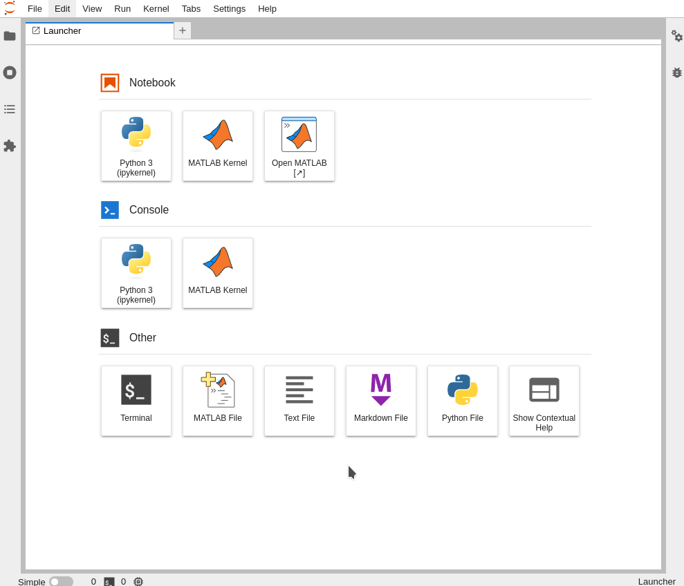</p>|
|**Launch MATLAB in a browser**|<p align="center">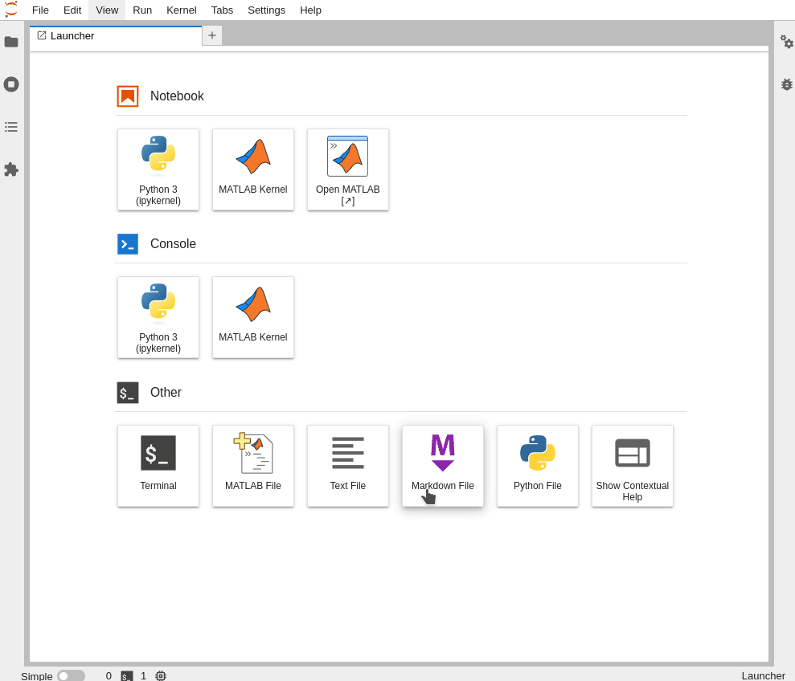</p>|

This package supports both classic Jupyter and JupyterLab, however, some capabilities may be limited to the JupyterLab interface.

This package is under active development. To report any issues or suggestions, see the [Feedback](#feedback) section.

----
## Requirements

* Python versions: **3.7** | **3.8** | **3.9**  | **3.10**

* MATLAB R2020b or later is installed and on the system PATH.
  ```bash
  # Confirm MATLAB is on the PATH
  which matlab
  ```
  *note:* Only required if you want to execute MATLAB code. Viewing notebooks does not require MATLAB to be installed.

* System dependencies required to run MATLAB.
  - The `base-dependencies.txt` files in the [matlab-deps](https://github.com/mathworks-ref-arch/container-images/tree/master/matlab-deps) repository lists the basic libraries that need to be installed for the desired combination of MATLAB version & Operating system. Refer to the Dockerfiles in the same folder for exemplar usage of these files.</br></br>
  
* X Virtual Frame Buffer (Xvfb) : (only for Linux® based systems)

  Install it on your linux machine using:
  ```bash
  # On a Debian/Ubuntu based system:
  $ sudo apt install xvfb
  ```
  ```bash
  # On a RHEL based system:
  $ yum search Xvfb
  xorg-x11-server-Xvfb.x86_64 : A X Windows System virtual framebuffer X server.
  $ sudo yum install xorg-x11-server-Xvfb
  ```
* [Browser Requirements](https://www.mathworks.com/support/requirements/browser-requirements.html)

* Supported Operating Systems:
    * Linux®
    * MacOS

  **NOTE** : Support for Windows Operating system is unavailable due to [jupyter-server-proxy/issue#47](https://github.com/jupyterhub/jupyter-server-proxy/issues/147)

## Installation

The MATLAB Integration for Jupyter is provided as a Python® package can either be installed from PyPI or can be built from sources as shown below.

### PyPI
This repository can be installed directly from the Python Package Index.
```bash
python3 -m pip install jupyter-matlab-proxy
```
You must have [MATLAB](https://www.mathworks.com/help/install/install-products.html) installed to execute MATLAB code through Jupyter,
installing this package will not automatically install MATLAB.

### Building From Sources
Building from sources requires Node.js® version 16 or higher.
To install Node.js see [Node.js downloads](https://nodejs.org/en/download/).
```bash
git clone https://github.com/mathworks/jupyter-matlab-proxy.git

cd jupyter-matlab-proxy

python3 -m pip install .
```

## Usage

Open your Jupyter environment by starting jupyter notebook or lab

  ```bash
  # For Jupyter Notebook
  jupyter notebook

  # For Jupyter Lab
  jupyter lab 
  ```

Upon successful installation of `jupyter-matlab-proxy`, your Jupyter 
environment should present options to launch a Jupyter notebook with a MATLAB kernel, and to access MATLAB in a browser.

|Classic Jupyter | JupyterLab |
|--|--|
|<p align="center"></p> | <p align="center"></p> |

## Detailed Usage
When JupyterLab is opened you will be presented with multiple options.

||
|-|

### **MATLAB Kernel: Opens a Jupyter Notebook using a MATLAB Kernel**
Click the icon below to launch a notebook:

|Icon | Notebook |
|--|--|
|<p align="center"></p> | <p align="center">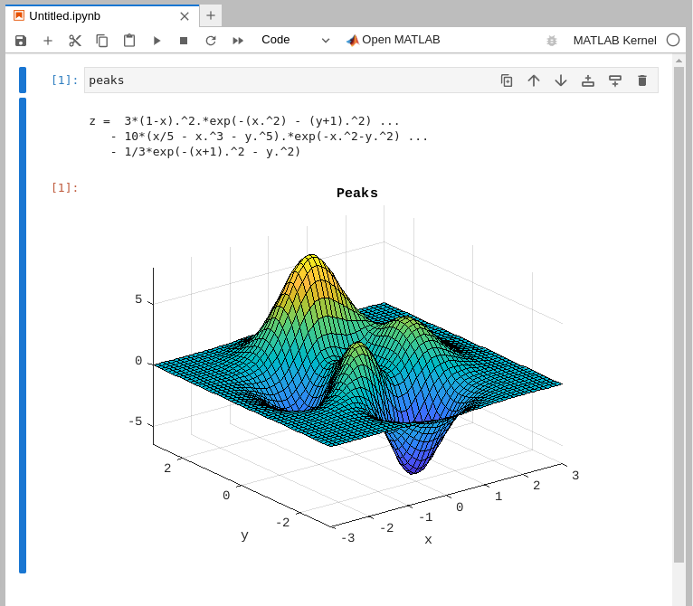</p> |


* The first time you execute code in a MATLAB notebook you will be asked to log in,
or use a network license manager. Follow the [licensing](#licensing) instructions below.
* Subsequent notebooks in the same server will not request for licensing information.
* Wait for the MATLAB session to start. This can take several minutes.
* **NOTE**: All notebooks in a Jupyter server, share the same underlying MATLAB process. Users must be mindful of this as executing code in one notebook will effect the workspace in other notebooks as well.

For more information, see [MATLAB Kernel for Jupyter](src/jupyter_matlab_kernel/README.md).

### **Open MATLAB: Access MATLAB in a Browser from JupyterLab**
Click the icon below to launch MATLAB in a browser:
|Icon | Desktop |
|--|--|
|<p align="center"></p> | <p align="center">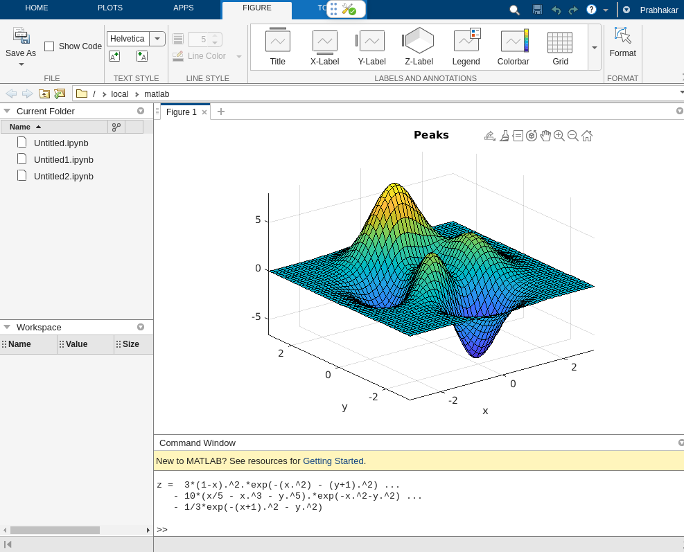</p> |

* Access MATLAB in a browser from your Jupyter environment.
* Notebooks in JupyterLab, also have a `Open MATLAB` shortcut on the top to access the MATLAB desktop.

For more information, see [Open MATLAB in a browser](src/jupyter_matlab_proxy/README.md).

|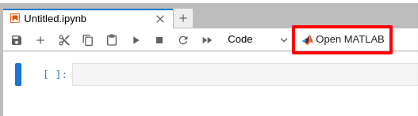|
|-|

### **MATLAB File: Open a New MATLAB File (.m) in JupyterLab**
Click the icon below to start editing a new MATLAB File:
|Icon | MATLAB File |
|--|--|
|<p align="center">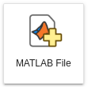</p> | <p align="center">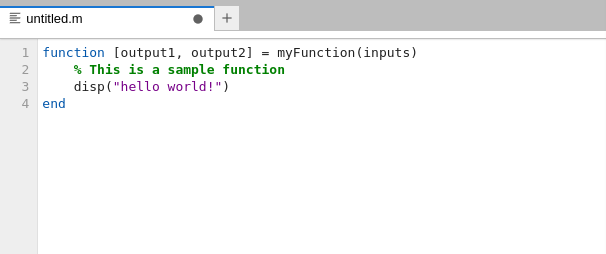</p> |
* Opens a new `MATLAB file` in a new JupyterLab tab.
* MATLAB code in this file will be highlighted appropriately.
* You can also use the command palette, by using `ctrl+shift+c` and then typing `New MATLAB File`.
* Execution of `MATLAB Files (.m)` files in JupyterLab is currently **not** supported.


## Licensing

* If prompted to do so, enter credentials for a MathWorks account associated with a MATLAB license. If you are using a network license manager, change to the _Network License Manager_ tab and enter the license server address instead.
To determine the appropriate method for your license type, consult [MATLAB Licensing Info](https://github.com/mathworks/jupyter-matlab-proxy/blob/main/MATLAB-Licensing-Info.md).

<p align="center">

</p>

## Integration with JupyterHub

To use this integration with JupyterHub®, you must install the `jupyter-matlab-proxy` Python package in the Jupyter environment launched by your JupyterHub platform. 

For example, if your JupyterHub platform launches Docker containers, then install this package in the Docker image used to launch them.

A reference architecture that installs `jupyter-matlab-proxy` in a Docker image is available at: [Use MATLAB Integration for Jupyter in a Docker Container](https://github.com/mathworks-ref-arch/matlab-integration-for-jupyter/tree/main/matlab).

## Limitations
* Notebooks running on the same server share the same MATLAB. It is currently not possible to have separate workspaces for each notebook.

* Kernels cannot restart MATLAB automatically when users explicitly shut MATLAB down using the `exit` command or through the web desktop interface. Users must manually start MATLAB through options provided when they click "Open MATLAB".

* Starting from R2022b onwards, users can define functions directly in a notebook cell. Such functions are only accessible from within the cell they are defined. Similar to [Add Functions to Scripts](https://mathworks.com/help/matlab/matlab_prog/local-functions-in-scripts.html)

* Some MATLAB commands are unavailable for use with notebooks. Typically, these are commands which require further interaction from users for example: `input`, `keyboard`.

* MATLAB commands that require user interaction are not supported in notebooks, and may either require the kernel to be interrupted, or require users to `Open MATLAB` to resume execution in the notebook. Examples: `input`, `keyboard`

* MATLAB Debugger commands are not supported in notebooks. Example: `dbstep, dbup, dbstack ...`

* MATLAB commands which require another browser tab to be opened, need MATLAB to also be opened in a browser tab. For example: `doc`, `appdesigner` etc.

* MATLAB notebooks and MATLAB files do not auto-indent after `case` statements.

* Locally licensed MATLABs are currently not supported. Users must either login using Online Licensing or use a Network License Manager.

* Execution of MATLAB Files (`.m`) files from Jupyter is not supported.

* Handles from Graphical objects do not persist between cells. See below for example:

    |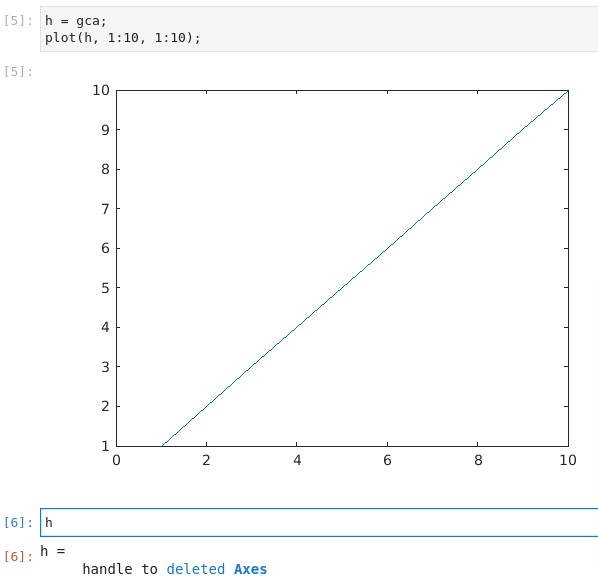|
    |-|

* Graphics functions like `gca, gcf, gco, gcbo, gcbf, clf, cla` which access `current` handles are **scoped to a notebook cell**. The example shows how using GCA to update the title of a figure gives unexpected results:
    |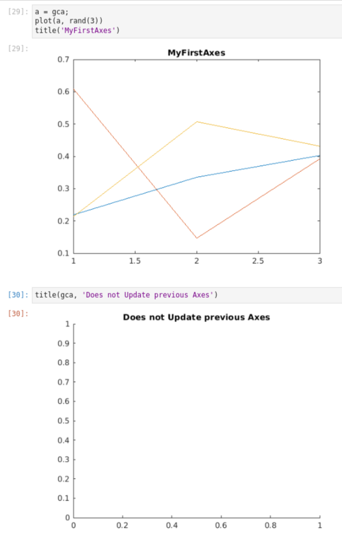|
    |-|

* `LASTERR, LASTERROR` do not capture MATLAB errors from execution in notebooks. This is fixed in **MATLAB R2022b**.

* MATLAB functions which create animations are not supported in notebooks. Example: `movie, vibes`

* Notebooks do not show intermediate figures that were created during execution. For example:
    |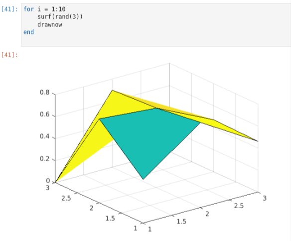|
    |-|

* Notebook results are truncated when there are more than 10 rows or 30 columns of results from MATLAB. This is represented by a `(...)` at the end of the result. Example:
    |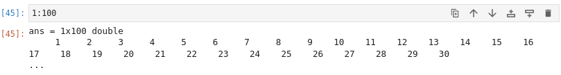|
    |-|


## Troubleshooting
See [Troubleshooting](./troubleshooting.md) for steps which help investigate common installation issues.


## Feedback

We encourage you to try this repository with your environment and provide feedback.
If you encounter a technical issue or have an enhancement request, create an issue [here](https://github.com/mathworks/jupyter-matlab-proxy/issues) or send an email to `jupyter-support@mathworks.com`

----

Copyright (c) 2021-2023 The MathWorks, Inc. All rights reserved.

----
