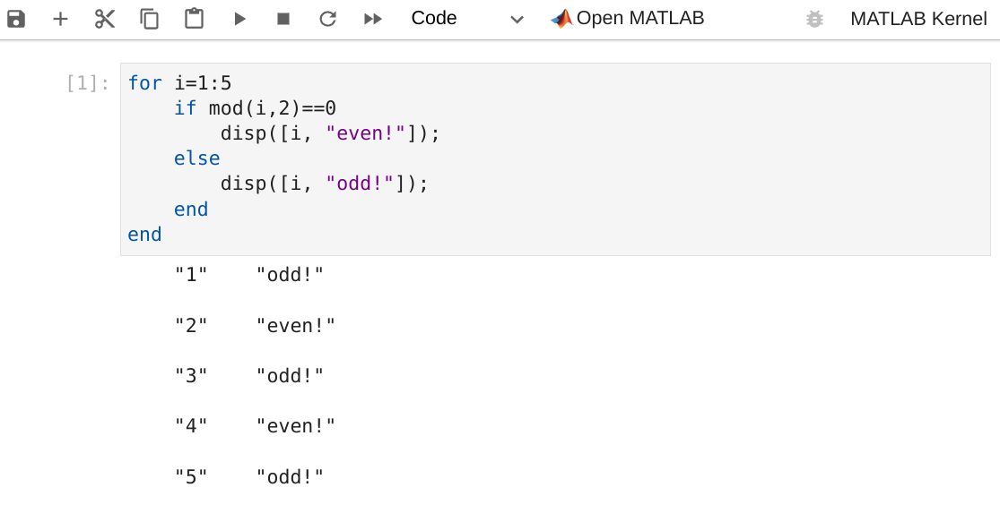
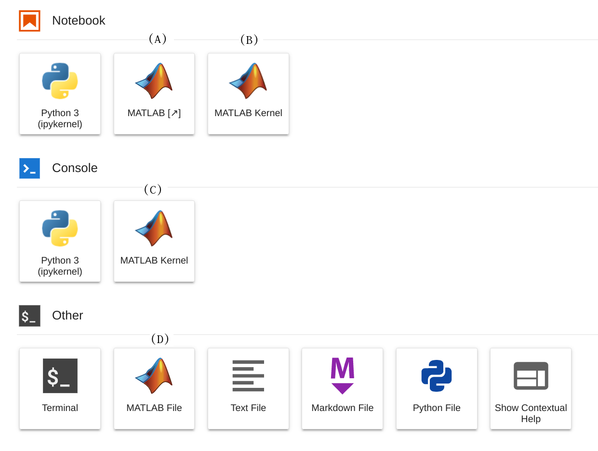

# MATLAB Integration for Jupyter

MATLAB Integration for Jupyter allows you to develop and execute MATLAB code in a Jupyter notebook and JupterLab.

* For MATLAB code written in a JupyterLab notebook, this package enables you to
  * execute MATLAB code.
  * write code with tab completion.
  * write code with syntax highlighting and autoindentation.
* This package also enables you to
  * access MATLAB in a browser from your Jupyter environment.
  * create ".m" files in JupyterLab.

<p align="center">
  
</p>

Other features provided by this package include
  * Inline static plot images
  * LaTeX representation for symbolic expressions
  * Function definition within .ipynb file

For more detail, on how to use these features see [Usage](#usage).
To report any issues or suggestions, see the [Feedback](#feedback) section.

----
## Requirements [TO CHECK]

* MATLAB® R2020b or later is installed and on the system PATH.
  ```bash
  # Confirm MATLAB is on the PATH
  which matlab
  ```  
* The dependencies required to run MATLAB.
  Refer to the Dockerfiles in the [matlab-deps](https://github.com/mathworks-ref-arch/container-images/tree/master/matlab-deps) repository for the desired version of MATLAB.

* JupyterLab version: **3** [TO CHECK]

* Python versions: **3.7** | **3.8** | **3.9**  | **3.10**
  
* X Virtual Frame Buffer (Xvfb) : (only for Linux® based systems)

  [** TO CHECK: This should be automatically installed as a dependency?**]

  Install it on your linux machine using:
  ```bash
  # On a Debian/Ubuntu based system:
  $ sudo apt install xvfb
  ```
  ```bash
  # On a RHEL based system:
  $ yum search Xvfb
  xorg-x11-server-Xvfb.x86_64 : A X Windows System virtual framebuffer X server.
  $ sudo yum install xorg-x11-server-Xvfb
  ```
* Python versions: **3.7** | **3.8** | **3.9**  | **3.10**
* [Browser Requirements](https://www.mathworks.com/support/requirements/browser-requirements.html)

* Supported Operating Systems:
    * Linux®
    * Windows® Operating System ( starting v0.4.0 of matlab-proxy )
    * MacOS (starting v0.5.0 of matlab-proxy )

## Installation

### PyPI
This repository can be installed directly from the Python Package Index.
```bash
python -m pip install jupyter-matlab-proxy
```

Installing this package will also install [JupyterLab](https://jupyterlab.readthedocs.io/en/stable/) and [Jupyter Server Proxy](https://jupyter-server-proxy.readthedocs.io/en/latest/) on your machine, if they are not installed already.

You must have [MATLAB](https://www.mathworks.com/help/install/install-products.html) installed to execute MATLAB code through Jupyter.

### Building From Sources
Building from sources requires Node.js® version 16 [TO CHECK] or higher.
To install Node.js see [Node.js downloads](https://nodejs.org/en/download/).
```bash
git clone https://github.com/mathworks/jupyter-matlab-proxy.git

cd jupyter-matlab-proxy

python -m pip install .
```

## Usage

## Starting JupyterLab

Upon successful installation of `jupyter-matlab-proxy`, your Jupyter environment should present options to launch a
Jupyter notebook with a MATLAB kernel, and to access MATLAB in a browser.

* Open your Jupyter environment by starting jupyter notebook or lab
  ```bash
  # For Jupyter Notebook
  jupyter notebook

  # For Jupyter Lab
  jupyter lab 
  ```
## JupyterLab Options
* **TODO: Add screenshots once kernel is integrated and icons are finalised.**
* When JupyterLab is opened you will be presented with multiple options.

<p align="center">
  
</p>

### MATLAB Kernel: Opening a MATLAB Notebook in JupyterLab
* The first time you execute code in a MATLAB notebook you will be asked to log in,
or use a network license manager. Follow the [licensing](#licensing) instructions below.
* Wait for the MATLAB session to start. This can take several minutes.
* Each MATLAB notebook is backed by the same MATLAB session, and therefore allows access to the same state.
* You can also open a JupyterLab console and execute MATLAB code there.
### Open MATLAB: Access MATLAB in a Browser from JupyterLab
* Access MATLAB in a browser from your Jupyter environment.
* For more information, see [Proxy](src/jupyter_matlab_proxy/README.md).
### MATLAB File: Opening a `.m` File in JupyterLab
* Opens a new `.m` file in a new JupyterLab tab.
* MATLAB code in this file will be highlighted appropriately.
* You can also open a new `.m` file by using the command palette, by using ctrl+shift+c and then typing `New MATLAB File`.
* Execution of `.m` files in JupyterLab is not currently supported.


## Licensing

* If prompted to do so, enter credentials for a MathWorks account associated with a MATLAB license. If you are using a network license manager, change to the _Network License Manager_ tab and enter the license server address instead.
To determine the appropriate method for your license type, consult TODO: CHECK IF THIS IS STILL APPROPRIATE [MATLAB Licensing Info](https://github.com/mathworks/jupyter-matlab-proxy/blob/main/MATLAB-Licensing-Info.md).

<p align="center">
  
</p>

* Wait for the MATLAB session to start. This can take several minutes.

## Integration with JupyterHub

To use this integration with JupyterHub®, you must install the `jupyter-matlab-proxy` Python package in the Jupyter environment launched by your JupyterHub platform. 

For example, if your JupyterHub platform launches Docker containers, then install this package in the Docker image used to launch them.

A reference architecture that installs `jupyter-matlab-proxy` in a Docker image is available at: [Use MATLAB Integration for Jupyter in a Docker Container](https://github.com/mathworks-ref-arch/matlab-integration-for-jupyter/tree/main/matlab).

## Unsupported workflows
* Executing MATLAB code which requires user input such as `input`, `keyboard` is not supported in JupyterLab notebooks. 
* Autoindentation is not supported after `case` statements.
* Simultaneous independent kernels are not supported, all MATLAB kernels will share the same workspace.
* Execution of `.m` files in JupyterLab is not currently supported.

## Troubleshooting
For a guide to troubleshooting issues with MATLAB proxy, see [Troubleshooting](./troubleshooting.md).

## Feedback

We encourage you to try this repository with your environment and provide feedback.
If you encounter a technical issue or have an enhancement request, create an issue [here](https://github.com/mathworks/jupyter-matlab-proxy/issues) or send an email to `jupyter-support@mathworks.com`

----

Copyright (c) 2021-2022 The MathWorks, Inc. All rights reserved.

----
