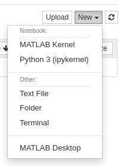
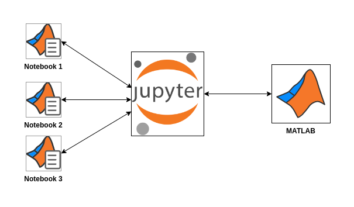
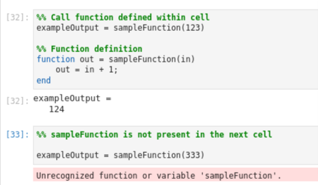

# MATLAB Kernel for Jupyter

This module is a part of the `jupyter-matlab-proxy` package and it provides a Jupyter Kernel for the MATLAB Language.

## Usage

Upon successful installation of `jupyter-matlab-proxy`, your Jupyter environment should present options to launch MATLAB.

Click on `MATLAB Kernel` to create a Jupyter notebook for MATLAB.

|Classic Jupyter | JupyterLab |
|--|--|
|

 | 

 |

## Architecture

||
|-|

**Key takeaways:**

* When a notebook is opened, a new kernel is created for it.

* When the first execution request is made the following occurs:
    * A licensing screen is presented if this information has not been provided previously.
    * A MATLAB process is launched by Jupyter if one has not been launched previously.

* Every subsequent notebook does **not** ask for licensing information or launch a new MATLAB process.

* Every notebook communicates with MATLAB through the Jupyter notebook server.

* A notebook can be thought of as another view into the MATLAB process.
    * Any variables or data created through the notebook manifests in the spawned MATLAB process.
    * This implies that all notebooks access the same MATLAB workspace, and users must keep this in mind when working with notebooks.

* If simulaneous execution requests are made from two notebooks, they are processed by MATLAB in a **first-in, first-out basis**.

* Kernel Interrupts can be requested through the Jupyter interface, and interrupt the execution thats currently processing in MATLAB.
    * *note*: The request interrupted may not be the one created by the notebook from which the interrupt was requested.

## Supported Features
* Execution of MATLAB code
* Tab completion
* Inline static plot images
* LaTeX representation for symbolic expressions
* **New from R2022b:** Function definition within notebook cells.
    * Functions can be defined in at the end of cell, and used within that cell.
    

## Limitations

Please see the toplevel [README](../../README.md#limitations) file for a listing of the current limitations.

## Feedback

We encourage you to try this repository with your environment and provide feedback.
If you encounter a technical issue or have an enhancement request, create an issue [here](https://github.com/mathworks/jupyter-matlab-proxy/issues) or send an email to `jupyter-support@mathworks.com`

----

Copyright (c) 2023 The MathWorks, Inc. All rights reserved.

----
